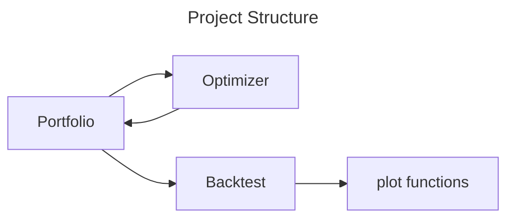
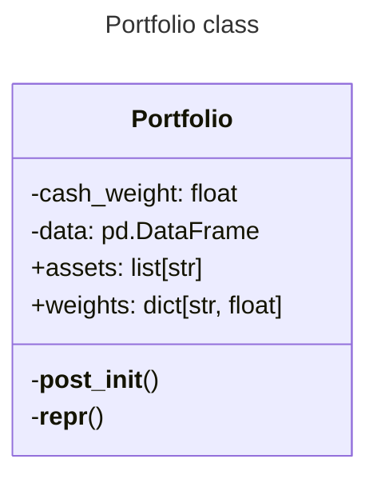

# McGill Portfolio 2024

## Functionality

- [ ] Mean variance optimization
- [ ] Portfolio backtest
- [ ] Portfolio visualization

## Structure

### Main classes responsibilities

This is a simple project structure. Just a few classes that interact with each other. 

Extand this structure to include:
- DataHandler: 

## `Portfolio` class

- input:
